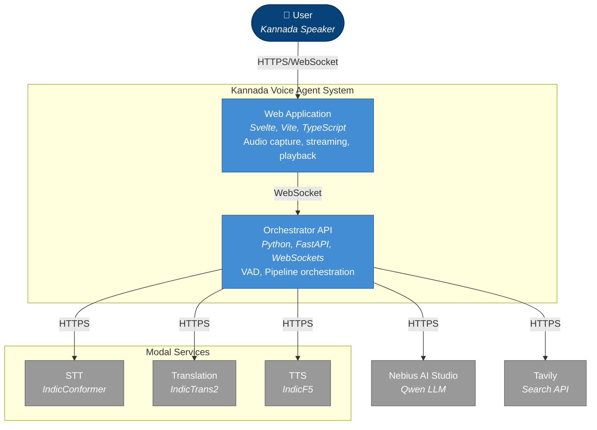

# Block View (Container) Diagram

This diagram shows the high-level containers of the application and their responsibilities.

```mermaid
flowchart TB
    User(["👤 User<br/><i>Kannada Speaker</i>"])

    subgraph VoiceAgentSystem["Kannada Voice Agent System"]
        WebApp["Web Application<br/><i>Svelte, Vite, TypeScript</i><br/>Audio capture, streaming, playback"]
        API["Orchestrator API<br/><i>Python, FastAPI, WebSockets</i><br/>VAD, Pipeline orchestration"]
    end

    subgraph ModalServices["Modal Services"]
        STT["STT<br/><i>IndicConformer</i>"]
        Trans["Translation<br/><i>IndicTrans2</i>"]
        TTS["TTS<br/><i>IndicF5</i>"]
    end

    Nebius["Nebius AI Studio<br/><i>Qwen LLM</i>"]
    Tavily["Tavily<br/><i>Search API</i>"]

    User -- "HTTPS/WebSocket" --> WebApp
    WebApp -- "WebSocket" --> API
    API -- "HTTPS" --> STT
    API -- "HTTPS" --> Trans
    API -- "HTTPS" --> TTS
    API -- "HTTPS" --> Nebius
    API -- "HTTPS" --> Tavily

    style User fill:#08427b,stroke:#052e56,color:#fff
    style WebApp fill:#438dd5,stroke:#2e6295,color:#fff
    style API fill:#438dd5,stroke:#2e6295,color:#fff
    style STT fill:#999999,stroke:#666666,color:#fff
    style Trans fill:#999999,stroke:#666666,color:#fff
    style TTS fill:#999999,stroke:#666666,color:#fff
    style Nebius fill:#999999,stroke:#666666,color:#fff
    style Tavily fill:#999999,stroke:#666666,color:#fff
```
