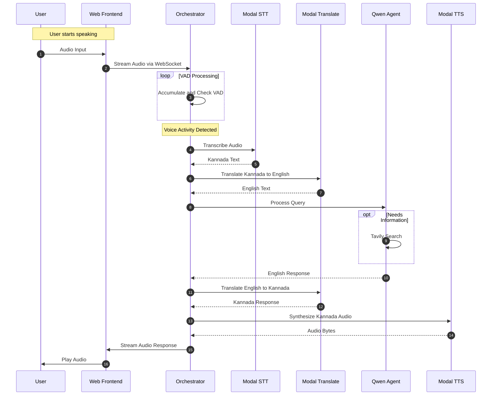

# Sequence Diagram

This diagram illustrates the flow of data during a single turn of conversation.

```mermaid
sequenceDiagram
    autonumber
    participant User
    participant WebApp as Web Frontend
    participant API as Orchestrator
    participant STT as Modal STT
    participant Trans as Modal Translate
    participant Agent as Qwen Agent
    participant TTS as Modal TTS

    Note over User,WebApp: User starts speaking
    User->>WebApp: Audio Input
    WebApp->>API: Stream Audio via WebSocket

    loop VAD Processing
        API->>API: Accumulate and Check VAD
    end

    Note over API: Voice Activity Detected

    API->>STT: Transcribe Audio
    STT-->>API: Kannada Text

    API->>Trans: Translate Kannada to English
    Trans-->>API: English Text

    API->>Agent: Process Query
    opt Needs Information
        Agent->>Agent: Tavily Search
    end
    Agent-->>API: English Response

    API->>Trans: Translate English to Kannada
    Trans-->>API: Kannada Response

    API->>TTS: Synthesize Kannada Audio
    TTS-->>API: Audio Bytes

    API->>WebApp: Stream Audio Response
    WebApp->>User: Play Audio
```
