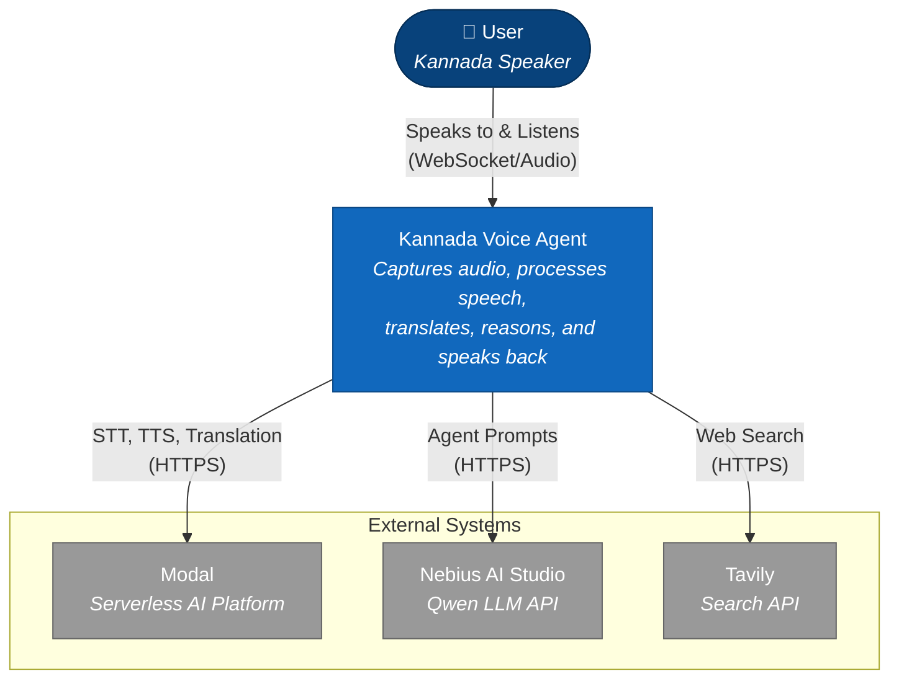

# System Context Diagram

This diagram outlines the high-level system context, showing how the User interacts with the Kannada Voice Agent and its dependencies on external services.

```mermaid
flowchart TB
    subgraph External["External Systems"]
        Modal["Modal<br/><i>Serverless AI Platform</i>"]
        Nebius["Nebius AI Studio<br/><i>Qwen LLM API</i>"]
        Tavily["Tavily<br/><i>Search API</i>"]
    end

    User(["👤 User<br/><i>Kannada Speaker</i>"])
    VoiceAgent["Kannada Voice Agent<br/><i>Captures audio, processes speech,<br/>translates, reasons, and speaks back</i>"]

    User -- "Speaks to & Listens<br/>(WebSocket/Audio)" --> VoiceAgent
    VoiceAgent -- "STT, TTS, Translation<br/>(HTTPS)" --> Modal
    VoiceAgent -- "Agent Prompts<br/>(HTTPS)" --> Nebius
    VoiceAgent -- "Web Search<br/>(HTTPS)" --> Tavily

    style User fill:#08427b,stroke:#052e56,color:#fff
    style VoiceAgent fill:#1168bd,stroke:#0b4884,color:#fff
    style Modal fill:#999999,stroke:#666666,color:#fff
    style Nebius fill:#999999,stroke:#666666,color:#fff
    style Tavily fill:#999999,stroke:#666666,color:#fff
```
